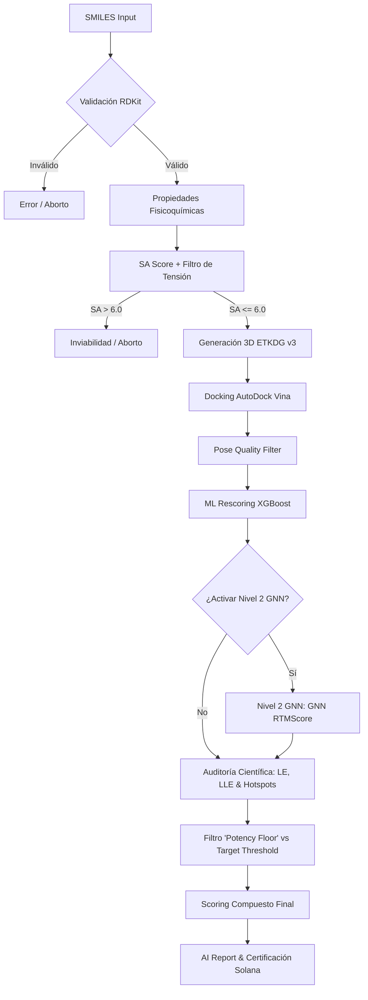

# Arquitectura de MolDesign AI (con el módulo interno Moldex) 🏗️🌐

Este documento describe la arquitectura técnica, el flujo de datos y las decisiones de diseño del ecosistema MolDesign AI.

## 1. Pipeline End-to-End (E2E) v6.3

El motor de MolDesign AI sigue un flujo lineal pero altamente validado para transformar un SMILES en un reporte científico certificado con auditoría profunda.

## 2. Microservicio de ML Rescoring

Debido a los requisitos científicos (ODDT, ProLIF, XGBoost, PyTorch, DGL), el rescoring opera en un microservicio dedicado (contenedor `rescoring`).

### Pipeline de Rescoring Interno
1.  **Pose Quality Filter**: 3 checks binarios (Contención en grid, contacto proteína-ligando < 4Å, enterramiento de átomos).
2.  **Feature Extraction**: Extracción de 1200 descriptores en v4 (interacciones 3D, shell counts, ECIF-lite, Morgan FPs).
3.  **Modelo A (Ranking)**: Predicción del score de ranking basada en interacciones específicas.
4.  **Modelo NULL (Control)**: Predicción basada SOLO en propiedades 1D/2D para detectar sesgo de ligando.
5.  **Delta de Especificidad**: `Score_A - Score_NULL`. Mide cuánto de la afinidad es debida al encaje geométrico real.
6.  **Nivel 2 GNN RTMScore**: Inferencia profunda basada en grafos utilizando un Residue-Atom Graph Transformer y predicción de densidad de distancias GMM en el bolsillo.
7.  **Hotspot Matching**: Identificación de contactos con residuos críticos biológicos (Threshold 5.0Å).
- **Dominio de Aplicabilidad (Mahalanobis)**: Check automático de si la molécula es similar a los datos de entrenamiento (PDBbind). Si es demasiado exótica, el sistema degrada la confianza del ML para evitar la extrapolación ciega.
- **Interpretación por Likelihood Ratios (LR)**: En lugar de dar un número frío, el sistema comunica cuánto más probable es encontrar actividad real dado el score obtenido (basado en el panel de calibración de 40 compuestos).

## 3. Infraestructura y Orquestación

MolDesign utiliza una arquitectura de microservicios orquestada por **Docker Compose** para garantizar el aislamiento de dependencias científicas pesadas.

### Red Interna (moldesign_net)
Los servicios se comunican mediante una red bridge interna:
- **`api` (FastAPI)**: Punto de entrada, corre en Python 3.11. Se comunica con Redis para encolar tareas.

- **`worker` (Celery)**: Consume de Redis, ejecuta Vina y genera archivos 3D.
- **`rescoring` (FastAPI)**: Microservicio en Python 3.12 (necesario para ODDT/ProLIF). Expone el endpoint `POST /rescore`.
- **`tunnel` (Cloudflared)**: Crea un túnel seguro hacia `api:8000`, permitiendo que el servidor local sea accesible sin abrir puertos en el router.

### Despliegue Híbrido (Vercel + Home Lab)
MolDesign utiliza una arquitectura híbrida para maximizar el rendimiento y minimizar costes:
1.  **Frontend (Vercel)**: La interfaz de usuario se despliega en Vercel para garantizar baja latencia global y despliegues atómicos.
2.  **Backend (Servidor Ubuntu Local)**: Todo el procesamiento pesado (Docking, ML, GPU) ocurre en un servidor dedicado en el Home Lab del usuario (Ryzen 3).
3.  **Puente Seguro (Cloudflare)**: Un contenedor de Cloudflare Tunnel expone el backend local mediante un subdominio cifrado.
4.  **Sincronización Automática**: Un script de CI/CD detecta cambios en la URL del túnel y actualiza las variables de entorno (`NEXT_PUBLIC_API_URL`) en Vercel mediante su API oficial, asegurando que el frontend siempre apunte al servidor activo.

### Flujo de Tareas (Celery)
El worker utiliza una configuración de **Persistent Event Loop**:
- **Broker**: Redis (db 0).
- **Backend**: Redis (db 0) para estado de tareas.
- **Protocolo**: `asyncio` integrado con Celery mediante un pool personalizado para evitar el cierre de conexiones PostgreSQL/MinIO durante el docking.

### Almacenamiento y Trazabilidad (MinIO / Solana)
Toda la persistencia de archivos moleculares es S3-compatible:
- **Bucket `molecules`**: Contiene las estructuras base (SDF) y los PDB preparados.
- **Bucket `docking`**: Almacena los resultados crudos de Vina (PDBQT) y las poses optimizadas.
- **Inmutabilidad Solana (Devnet)**: Cada evaluación exitosa genera un certificado inmutable en la blockchain de Solana, almacenando el hash del resultado para prevenir alteraciones.
- **Certificación PDF**: Un motor de reportes basado en `ReportLab` genera documentos científicos que incluyen el ID de transacción de Solana y el desglose de afinidad.
- **Trazabilidad Interna**: Los nombres de archivos se basan en el **SHA-256** del SMILES canónico.

## 4. Gestión de Datos y Calidad Molecular

Para garantizar la escalabilidad y relevancia de los resultados, MolDesign utiliza un sistema de **Auto-Purge**:
- **Filtrado por Score**: Las moléculas con score < 60 que no son guardadas explícitamente se eliminan tras 1 hora.
- **Detección de Prometedoras**: Solo los "Hits" científicos (> 60) o las moléculas guardadas por usuarios registrados persisten indefinidamente.
- **Borrado en Cascada**: Se garantiza la integridad mediante `ON DELETE CASCADE` en PostgreSQL.

Para más detalle, ver [DATA_MANAGEMENT.md](./DATA_MANAGEMENT.md).

## 5. Algoritmos de Machine Learning

### El Modelo XGBoost (v4)
El "Cerebro" de MolDesign no predice afinidades absolutas, sino que optimiza el **Ranking** (Spearman):
- **Dataset**: PDBbind Refined Set (v2020), filtrado mediante una "Auditoría VIP" que eliminó estructuras de baja resolución (>2.5Å).
- **Features (176)**:
    - `shell_counts`: Contactos átomo-átomo en 3 capas de distancia (3Å, 6Å, 12Å).
    - `ecif_lite`: Interaction fingerprints basados en tipos de átomos electro-químicos.
    - `physchem`: MW, LogP, TPSA normalizados.
- **Optimización**: Función de pérdida `rank:pairwise` (LambdaMART). Esto asegura que el sistema sea excelente identificando cuál molécula es mejor que otra, incluso si el valor absoluto de kcal/mol tiene ruido.
