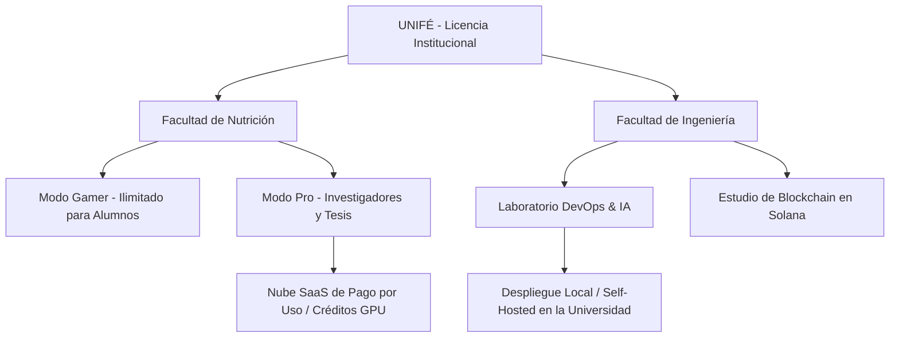

# Propuesta de Colaboración Académica y Comercial: Proyecto UNIFÉ
## MolDesign: De la Ciencia de los Alimentos a las Tecnologías Emergentes

Esta propuesta presenta un enfoque dual diseñado específicamente para las fortalezas académicas de la **Universidad Femenina del Sagrado Corazón (UNIFÉ)**, aprovechando su oferta de pregrado y posgrado en dos grandes pilares: **Ciencias de la Nutrición** e **Ingeniería de Sistemas**.

---

## 🍎 Pilar 1: Facultad de Nutrición y Dietética
### El "Buscador de Fitonutrientes y Nutracéuticos"

En lugar de comercializar la plataforma bajo un enfoque netamente oncológico o farmacológico tradicional, la suite se reconfigura como un **software de bioinformática nutricional de precisión**. Esto permite a los estudiantes e investigadores estudiar a nivel atómico cómo los componentes bioactivos de los alimentos interactúan con el cuerpo humano.

### 🎮 Modo Gamer (Pregrado en Nutrición y Dietética)
*   **Propósito:** Gamificación del aprendizaje de bioquímica y nutrición molecular.
*   **Dinámica Educativa:** Los estudiantes pueden modelar interacciones clásicas de nutrientes-receptores en una interfaz visual e interactiva.
    *   *Ejemplo práctico:* Analizar cómo los polifenoles del té verde o los compuestos de la maca peruana se acoplan a los receptores celulares para reducir el estrés oxidativo o regular la glucosa.
    *   Los alumnos diseñan o modifican variantes de moléculas para ver en tiempo real cómo cambia su "score de afinidad" con barras de progreso animadas, simplificando la física termodinámica compleja en retos visuales competitivos.

### 🔬 Modo Pro (Maestría en Ciencias de la Nutrición y Alimentación Humana)
*   **Propósito:** Investigación científica y tesis de posgrado en alimentos funcionales peruanos.
*   **Dinámica de Investigación:** Mapear el perfil nutracéutico de la biodiversidad andina y amazónica.
    *   *Caso de estudio:* Modelar la afinidad de unión de flavonoides específicos contra receptores antiinflamatorios (como la COX-2) o de longevidad celular (como SIRT1 / AMPK) utilizando el pipeline de acoplamiento molecular avanzado.
    *   **Reportes de Grado Científico:** Generación automática de reportes PDF detallando energías de unión libre, análisis de contactos biofísicos y visualización 3D con Molstar para incluir directamente en tesis y publicaciones científicas indexadas.

### 🧬 Catálogo Científico de Nutrición: Conformación Activa vs Inactiva

Una de las innovaciones más potentes para la investigación en posgrado es la capacidad de evaluar **mecanismos de acción específicos (Agonismo vs Antagonismo)** mediante el uso de conformaciones estructurales específicas del PDB. MolDesign permite realizar simulaciones comparativas de acoplamiento molecular según el estado tridimensional del receptor:

#### 1. Biblioteca Nutracéutica de Nueva Incorporación:
*   **GLP-1R (Receptor de GLP-1 - Regulación de la Saciedad y Obesidad):**
    *   *Conformación Activa (`6X1A` / `6B3J`):* Receptor abierto y acoplado a proteína G, ideal para simular fitonutrientes que actúen como saciantes naturales (agonistas).
    *   *Conformación Inactiva (`6ORV`):* Estructura cerrada del receptor. Útil para corroborar la pérdida de afinidad y el mecanismo de activación.
*   **SIRT1 (Sirtuina-1 - Gen de la Longevidad y Antienvejecimiento):**
    *   *Conformación Activa (`4I5I`):* Complejo activado unido a cofactores. Permite cribar moléculas de la biodiversidad peruana (como el resveratrol) que actúen como activadores alostéricos de la longevidad celular.
*   **COX-2 (Ciclooxigenasa-2 - Biomarcador de Inflamación Celular):**
    *   *Conformación Inhibida (`5IKR` / `5IKQ`):* Enzima unida a antiinflamatorios de referencia. Ideal para descubrir bloqueadores naturales de la inflamación en extractos de plantas medicinales (antagonismo competitivo).
*   **PPAR-γ (Metabolismo de Lípidos y Sensibilidad a la Insulina):**
    *   *Conformación Activa (`6D8X`):* Unido a agonistas completos de alta afinidad. Mapea el acoplamiento de ácidos grasos (como el Omega-3 del Sacha Inchi) para la reducción de lípidos.
*   **AMPK (Proteína Quinasa Activada por AMP - Regulador Energético):**
    *   *Conformación Activa (`4RER`):* Enzima en su estado fosforilado y activado. Esencial para buscar compuestos bioactivos que estimulen el metabolismo celular y combatan la resistencia a la insulina.

#### 2. Expansión a Receptores en Producción Actual:
Esta misma lógica de comparación estructural se despliega sobre las dianas oncológicas y endocrinas ya activas en la plataforma:
*   **Receptor de Estrógeno (ER-α - Cáncer de Mama):**
    *   *Conformación Inactiva/Antagonista (`3ERT`):* Bloqueado por 4-Hidroxitamoxifeno. Permite buscar moléculas que impidan la proliferación celular.
    *   *Conformación Activa/Agonista (`1ERE`):* Estructura unida a Estradiol. Permite estudiar fitoestrógenos que mimeticen la acción hormonal.
*   **AKT1 (Ruta de Supervivencia Celular):**
    *   *Conformación Inactiva (`3O96`):* Estabilizado por inhibidores alostéricos.
    *   *Conformación Activa (`4EKL`):* Estado fosforilado catalíticamente activo para evaluar inhibición directa.

---

## 💻 Pilar 2: Ingeniería de Sistemas y Tecnologías Emergentes
### El Laboratorio de Innovación y Cómputo Distribuido

Para la **carrera de Ingeniería de Sistemas** y la **Maestría en Innovación y Tecnologías Emergentes**, la plataforma no es solo una herramienta de química médica, sino un **caso de estudio real y de producción** sobre arquitectura de software de alto rendimiento, Inteligencia Artificial aplicada y Web3.

### 🌐 Casos de Estudio Académicos:
1.  **Redes Neuronales de Grafos (AI/ML):**
    *   Estudio e implementación del modelo **RTMScore GNN** (PyTorch) en el Nivel 2. Los estudiantes de maestría pueden analizar cómo los algoritmos de grafos y Modelos de Mezclas Gaussianas (GMM) predicen interacciones moleculares complejas con mayor rapidez que la física tradicional.
2.  **Trazabilidad Científica con Web3 (Blockchain):**
    *   Estudio del módulo de certificación de propiedad intelectual inmutable sobre la red **Solana (Devnet)**. Un caso de uso práctico sobre cómo la tecnología blockchain protege la autoría científica de los descubrimientos sin intermediarios tradicionales.
3.  **Arquitectura Distribuida y Microservicios:**
    *   Uso de colas de mensajería asíncronas con **Celery y Redis** sobre servidores híbridos conectados mediante túneles dinámicos. Esto sirve como laboratorio práctico para asignaturas de sistemas distribuidos, computación en la nube y optimización de concurrencia.

---

## 💼 Propuesta de Modelo SaaS Académico

Para facilitar la adquisición por parte de la UNIFÉ, proponemos un esquema de licenciamiento en la nube de bajo costo operativo pero alto valor percibido:

### 1. Plan Educativo (SaaS Cloud):
*   Acceso ilimitado al **Modo Gamer** para todos los estudiantes de nutrición mediante un pago anual corporativo muy bajo. El procesamiento es rápido (Nivel 1) y consume pocos recursos de servidor.

### 2. Plan Investigación (Créditos de Cómputo):
*   Acceso al **Modo Pro** para los investigadores de la maestría. La universidad compra bolsas de créditos de procesamiento en la nube para ejecutar simulaciones de alta fidelidad (OpenMM y GNN RTMScore) sin necesidad de comprar costosas supercomputadoras locales.

### 3. Plan Integración Tecnológica (Código Abierto):
*   Los alumnos de Ingeniería de Sistemas pueden descargar partes del repositorio open-source, compilar sus propios contenedores en los laboratorios de la universidad, y desarrollar extensiones locales de la plataforma como proyectos de curso.

---
> [!TIP]
> **El gran diferenciador peruano:** 
> Perú cuenta con una de las mayores biodiversidades de plantas y alimentos funcionales del mundo (Maca, Camu Camu, Sacha Inchi, Maíz Morado). Vender esta plataforma a la UNIFÉ como la **herramienta definitiva para digitalizar y certificar científicamente el poder de los nutracéuticos peruanos** usando Inteligencia Artificial y Blockchain es una narrativa sumamente atractiva para captar fondos universitarios e interés del gobierno (CONCYTEC).
