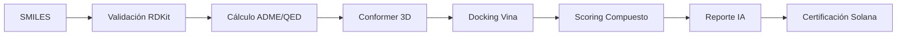

# MolDesign AI 🧬🔗

**Plataforma de Descubrimiento Farmacológico en Silico con Rigor Industrial y Certificación Blockchain.**


> **"Democratizando la creación de fármacos mediante el rigor de la ciencia computacional."**

MolDesign es una plataforma *Open Science* que permite a cualquier persona diseñar moléculas y evaluarlas contra blancos biológicos reales, utilizando los mismos estándares y herramientas que las grandes farmacéuticas. Cada hallazgo es certificado de forma inmutable en la blockchain de Solana, otorgando reconocimiento permanente al **creador in silico**.

---

## 🚀 Características Principales

*   🧪 **Pipeline Científico Real**: No es una simulación visual; es un motor que ejecuta RDKit y AutoDock Vina en tiempo real.
*   📊 **Score Compuesto Industrial**: Evaluación basada en Afinidad de Docking (45%), ADME (30%) y Drug-likeness (25%).
*   🛡️ **Rigor de Ligand Efficiency**: Filtro industrial de -0.30 kcal/mol/at para eliminar falsos positivos inespecíficos.
*   📈 **Actividad en Tiempo Real**: Estadísticas globales de la comunidad integradas directamente en el núcleo del sistema.
*   🤖 **Interpretación IA Honesta**: Integración con Gemini y Claude para explicar resultados sin inventar ni modificar datos científicos.
*   🔗 **Certificación Blockchain**: Registro inmutable de hallazgos en **Solana Devnet** con generación automática de certificados PDF.
*   🌍 **Ciencia Abierta (CC0)**: Todo el conocimiento generado es de dominio público, protegiendo la autoría pero eliminando barreras de IP.

---

## 🔬 El Motor Científico

MolDesign no es una "caja negra". Cada número es trazable y reproducible:

| Proceso | Herramienta | Función |
| :--- | :--- | :--- |
| **Validación** | RDKit | Verificación de valencia, SMILES y reglas químicas. |
| **Propiedades** | RDKit | Cálculo de LogP, TPSA, QED, Lipinski y pesos moleculares. |
| **3D Engine** | ETKDG v3 | Generación de conformeros tridimensionales de precisión. |
| **Docking** | AutoDock Vina 1.2 | Simulación de acoplamiento molecular contra receptor **5-HT1A (7E2Y)**. |
| **Interpretación** | Gemini / Claude | Análisis semántico de resultados para usuarios no expertos. |

---

## 🗺️ Pipeline E2E



---

## 🛠️ Guía para Desarrolladores

### Requisitos Previos
*   **Docker & Docker Compose** (Recomendado).
*   **Python 3.12+** & **Node.js 18+**.
*   **AutoDock Vina 1.2.x** (Si se corre fuera de Docker).

### 🚀 Instalación Rápida (Docker)
1.  **Clona y entra**:
    ```bash
    git clone https://github.com/srcacahuate619/molecule-design.git
    cd molecule-design
    ```
2.  **Configura**: `cp .env.example .env` (Edita con tus API Keys).
3.  **Lanza**: `docker compose up --build`.

### 🔧 Instalación Manual
*   **Backend**: `cd backend && pip install -r requirements.txt && uvicorn api.main:app`.
*   **Frontend**: `cd frontend && npm install && npm run dev`.

---

## 📡 Despliegue y Arquitectura

El proyecto está diseñado para escalar de forma asíncrona mediante trabajadores de Celery:

*   **Frontend**: Next.js 14 desplegado en **Vercel**.
*   **Backend**: FastAPI orquestado en **Railway**.
*   **Workers**: Celery ejecutando procesos de docking pesados en paralelo.
*   **Base de Datos**: PostgreSQL 17 + Redis para colas de mensajería.
*   **Storage**: Compatible con S3 para almacenamiento de estructuras PDB y SDF.

### Despliegue Rápido
Consulta el archivo [`.env.example`](./.env.example) para configurar las variables necesarias y sigue la guía de despliegue en la documentación interna.

---

## 💡 Filosofía: Democratización de la Ciencia

En MolDesign, creemos que el próximo fármaco revolucionario puede venir de cualquier lugar. Al usar **Solana** para registrar los hallazgos, garantizamos que:
1. El **autor in silico** tenga una prueba irrefutable de su descubrimiento.
2. El conocimiento sea **libre (CC0)**, permitiendo que la humanidad avance más rápido que los intereses comerciales.

---

## 👨‍💻 Creador

**Johan Amezcua**  
*Fundador y desarrollador de MolDesign*  
📧 [26000885@es.uveg.edu.mx](mailto:26000885@es.uveg.edu.mx)  
UVEG • Ingeniería en Software

---

## ⚖️ Licencia

Este proyecto está bajo la licencia **MIT**. Sin embargo, los descubrimientos certificados por los usuarios en la plataforma son liberados bajo **Creative Commons Zero (CC0)**.
