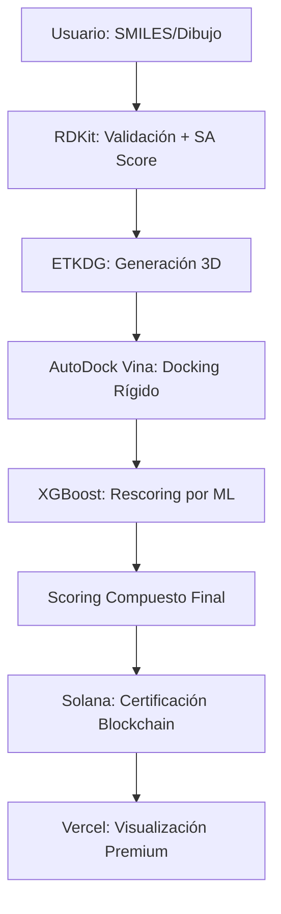

# MolDesign AI v5.0 🧬🚀

**Plataforma de Descubrimiento Farmacológico con Rescoring por ML, Rigor Industrial y Certificación Blockchain.**

> **"Ciencia de frontera, validada y accesible."**

MolDesign es una plataforma *Open Science* de alto rendimiento que combina la física del docking molecular (**AutoDock Vina**) con la inteligencia del rescoring por Machine Learning (**XGBoost + ProLIF**). El sistema está diseñado para identificar ligandos con potencial real, validado contra fármacos aprobados en **2023-2024**.

---

## ✨ Novedades de la Fase 5.0 (Mayo 2026)

*   🧠 **Cerebro XGBoost**: Implementación de un modelo de rescoring entrenado con PDBbind 2020 que corrige las afinidades de Vina basándose en interacciones geométricas 3D (Fingerprints ProLIF).
*   📊 **Validación de Generalización**: Spearman Rho (ρ) de **0.512** en un set ciego de fármacos post-2022, garantizando que el modelo funciona en química nueva.
*   🎨 **UX Premium Glassmorphism**: Interfaz rediseñada para una experiencia inmersiva, con orbes dinámicos y tooltips técnicos persistentes.
*   ⚡ **Infraestructura Ryzen**: Backend orquestado en hardware dedicado (Ryzen 3) para procesamiento masivo de docking en segundos.
*   🛡️ **Stress Tested**: Validado para soportar 10 usuarios simultáneos con gestión de colas distribuida (Celery + Redis).

---

## 🔬 El Motor Científico v5.0

MolDesign utiliza un pipeline híbrido para maximizar la precisión:

| Proceso | Tecnología | Razón Científica |
| :--- | :--- | :--- |
| **Validación** | RDKit | Asegura valencia química y accesibilidad sintética (SA Score). |
| **3D Engine** | ETKDG v3 | Generación de conformeros con geometría bioactiva. |
| **Docking** | Vina 1.2.5 | Búsqueda exhaustiva del sitio activo en el receptor **5-HT1A (7E2Y)**. |
| **Rescoring ML** | **XGBoost** | Corrección de afinidad basada en interacciones 3D ciego-específicas. |
| **Inmutabilidad** | Solana | Registro permanente del hallazgo en la red Devnet. |

---

## 🏗️ Arquitectura del Sistema

---

## 🛠️ Guía de Despliegue

### Requisitos
*   Docker & Docker Compose.
*   Hardware recomendado: 4+ núcleos CPU (para docking paralelo).

### Inicio Rápido
1.  `git clone https://github.com/srcacahuate619/molecule-design.git`
2.  `cp .env.example .env` (Configura tus claves de Solana y Gemini).
3.  `docker compose up --build -d`

El sistema levantará:
- **API (FastAPI)**: Puerto 8010.
- **Rescoring (Python)**: Puerto 8001.
- **Worker (Celery)**: Procesamiento de docking.
- **Frontend (Next.js)**: Puerto 3000.

---

## 👨‍💻 Autor y Visión

**Johan Amezcua**  
Ingeniero en Software • UVEG  
📧 [26000885@es.uveg.edu.mx](mailto:26000885@es.uveg.edu.mx)

MolDesign nació para eliminar el muro de cristal entre la biotecnología de élite y el resto del mundo. Creemos en una ciencia donde el mérito se mida por la calidad de la molécula diseñada, no por el presupuesto del laboratorio.

---

## ⚖️ Licencia

Código bajo licencia **MIT**. Descubrimientos certificados bajo **CC0 (Dominio Público)**.
