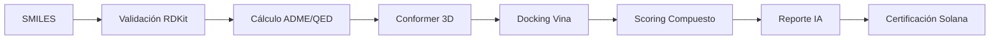

# MolDesign AI 🧬🔗

**Plataforma de Descubrimiento Farmacológico en Silico con Rigor Industrial y Certificación Blockchain.**


> **"Democratizando la creación de fármacos mediante el rigor de la ciencia computacional."**

MolDesign es una plataforma *Open Science* que permite a cualquier persona diseñar moléculas y evaluarlas contra blancos biológicos reales, utilizando los mismos estándares y herramientas que las grandes farmacéuticas. Cada hallazgo es certificado de forma inmutable en la blockchain de Solana, otorgando reconocimiento permanente al **creador in silico**.

---

## 🚀 Características Principales

*   🧪 **Pipeline Científico Real**: No es una simulación visual; es un motor que ejecuta RDKit y AutoDock Vina en tiempo real.
*   📊 **Score Compuesto Industrial**: Evaluación basada en Afinidad de Docking (45%), ADME (30%) y Drug-likeness (25%).
*   🛡️ **Rigor de Ligand Efficiency**: Filtro industrial de -0.30 kcal/mol/at para eliminar falsos positivos inespecíficos.
*   📈 **Actividad en Tiempo Real**: Estadísticas globales de la comunidad integradas directamente en el núcleo del sistema.
*   🤖 **Interpretación IA Honesta**: Integración con Gemini y Claude para explicar resultados sin inventar ni modificar datos científicos.
*   ⚖️ **Rigor Científico v4**: Filtro de accesibilidad sintética (SA) con detección de tensión de anillo y penalización de fragmentos pequeños.
*   🔗 **Certificación Blockchain**: Registro inmutable de hallazgos en **Solana Devnet** con generación automática de certificados PDF.
*   🌍 **Ciencia Abierta (CC0)**: Todo el conocimiento generado es de dominio público, protegiendo la autoría pero eliminando barreras de IP.

---

## 🔬 El Motor Científico

MolDesign no es una "caja negra". Cada número es trazable y reproducible:

| Proceso | Herramienta | Función |
| :--- | :--- | :--- |
| **Validación** | RDKit | Verificación de valencia, SMILES y reglas químicas. |
| **Propiedades** | RDKit | Cálculo de LogP, TPSA, QED, Lipinski y pesos moleculares. |
| **3D Engine** | ETKDG v3 | Generación de conformeros tridimensionales de precisión. |
| **Docking** | AutoDock Vina 1.2 | Simulación de acoplamiento molecular contra receptor **5-HT1A (7E2Y)**. |
| **Interpretación** | Gemini / Claude | Análisis semántico de resultados para usuarios no expertos. |

---

## 🗺️ Pipeline E2E



---

## 🛠️ Guía para Desarrolladores

### Requisitos Previos
*   **Docker & Docker Compose** (Recomendado).
*   **Python 3.12+** & **Node.js 18+**.
*   **AutoDock Vina 1.2.x** (Si se corre fuera de Docker).

### 🚀 Instalación Rápida (Docker)
1.  **Clona y entra**:
    ```bash
    git clone https://github.com/srcacahuate619/molecule-design.git
    cd molecule-design
    ```
2.  **Configura**: `cp .env.example .env` (Edita con tus API Keys).
3.  **Lanza**: `docker compose up --build`.

### 🔧 Instalación Manual
*   **Backend**: `cd backend && pip install -r requirements.txt && uvicorn api.main:app`.
*   **Frontend**: `cd frontend && npm install && npm run dev`.

---

## 📡 Despliegue y Arquitectura (Producción)

El proyecto utiliza una arquitectura híbrida para garantizar potencia de cálculo (Backend) y accesibilidad global (Frontend):

*   **Frontend**: Next.js 14 desplegado en **Vercel** (Dominio principal: [molecule-design.vercel.app](https://molecule-design.vercel.app)).
*   **Backend (Ubuntu Remote)**: FastAPI orquestado en un servidor remoto Ubuntu dedicado para ejecutar tareas pesadas de docking sin restricciones de recursos de la nube.
*   **Túnel Cloudflare**: El backend se expone de forma segura mediante un túnel dinámico de Cloudflare, eliminando la necesidad de IPs estáticas o apertura de puertos.
*   **Sincronización Automática (`tunnel-sync`)**: Un servicio sidecar monitorea el túnel y actualiza automáticamente las variables de entorno en Vercel cada vez que el servidor se reinicia, garantizando que la conexión nunca se rompa.
*   **Workers**: Celery con un patrón de **Persistent Event Loop** para manejar docking molecular concurrente de forma estable.
*   **Almacenamiento**: **MinIO** (S3-compatible) para persistencia de estructuras 3D (PDB/SDF) y **PostgreSQL 15** para el historial molecular.

### 🛠️ Despliegue en Servidor Local/Remoto
1.  **Clona y entra**:
    ```bash
    git clone https://github.com/srcacahuate619/molecule-design.git
    cd molecule-design
    ```
2.  **Configura el entorno**: Crea un archivo `.env` en `backend/` con las claves de Gemini, Vercel Token y configuración de base de datos.
3.  **Lanza la orquestación**:
    ```bash
    docker compose up -d --build
    ```
    *Este comando levantará la API, el Worker de Celery, el Túnel y el Sincronizador de Vercel.*

---

## 🛡️ Rigor Científico y Estabilidad

MolDesign ha sido "endurecido" para evitar sesgos comunes en el diseño molecular computacional:

*   **Detección de Tensión de Anillo**: Bloqueo automático de moléculas imposibles (como el Cubano) mediante penalizaciones SA personalizadas.
*   **Calibración de Eficiencia (LE)**: Evitamos la inflación de scores en fragmentos pequeños para priorizar moléculas con potencial farmacológico real.
*   **Integridad 3D**: Extracción robusta de características de interacción incluso ante fallas de topología en archivos PDBQT.
*   **Async Isolation**: Aislamiento de loops de eventos en Celery para prevenir errores de "Event loop is closed" durante cálculos intensivos.

Para más detalles sobre estas optimizaciones, consulta el [Reporte de Optimización v4](docs/OPTIMIZATION_REPORT_V4.md).

---

## 💡 Filosofía: Democratización de la Ciencia

En MolDesign, creemos que el próximo fármaco revolucionario puede venir de cualquier lugar. Al usar **Solana** para registrar los hallazgos, garantizamos que:
1. El **autor in silico** tenga una prueba irrefutable de su descubrimiento.
2. El conocimiento sea **libre (CC0)**, permitiendo que la humanidad avance más rápido que los intereses comerciales.

---

## 👨‍💻 Creador

**Johan Amezcua**  
*Fundador y desarrollador de MolDesign*  
📧 [26000885@es.uveg.edu.mx](mailto:26000885@es.uveg.edu.mx)  
UVEG • Ingeniería en Software

---

## ⚖️ Licencia

Este proyecto está bajo la licencia **MIT**. Sin embargo, los descubrimientos certificados por los usuarios en la plataforma son liberados bajo **Creative Commons Zero (CC0)**.
